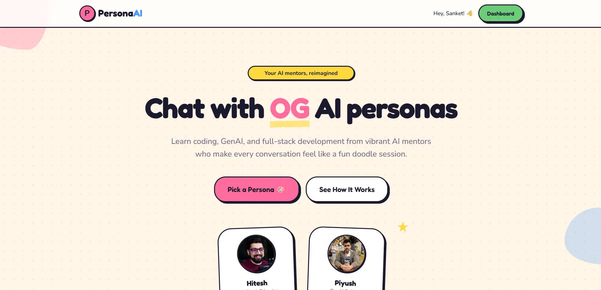
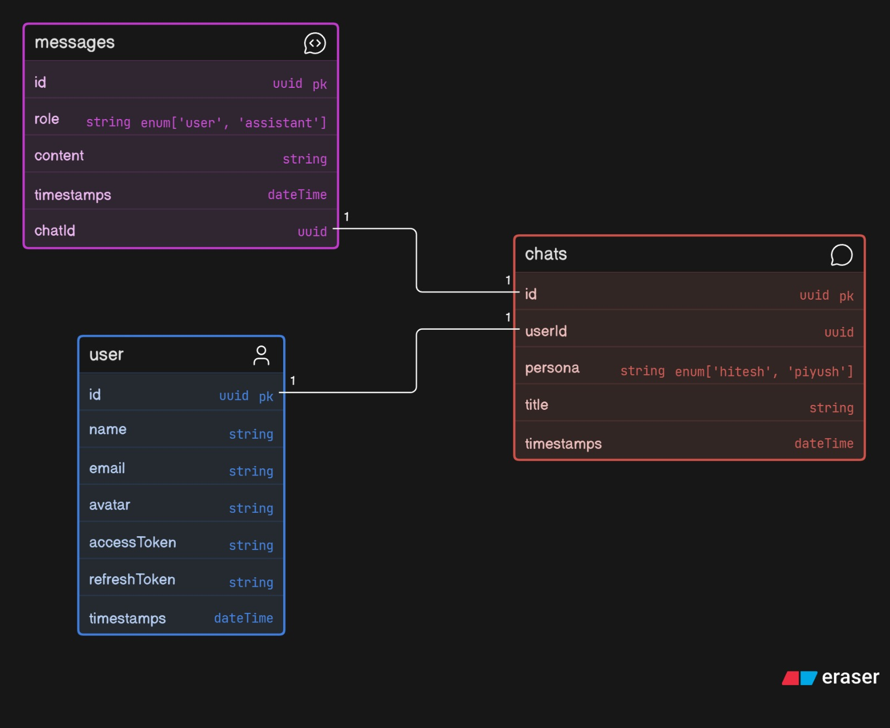

# PersonaAI

PersonaAI is a full-stack AI chat application where users can sign in with Google, choose a mentor persona, and chat with AI versions of Hitesh Choudhary or Piyush Garg. The frontend is built with Next.js, React, Tailwind CSS, and reusable UI components. The backend is an Express + TypeScript API that handles authentication, chat sessions, messages, MongoDB persistence, and OpenAI-powered persona responses.

## Project Preview



## Database ER Diagram



## Tech Stack

- **Frontend:** Next.js, React, TypeScript, Tailwind CSS, lucide-react, shadcn-style UI components
- **Backend:** Node.js, Express, TypeScript, MongoDB, Mongoose
- **Authentication:** Google OAuth, JWT access tokens, JWT refresh tokens, HTTP-only cookies
- **AI:** OpenAI chat completions with custom system prompts for each persona

## Repository Structure

```text
PersonaAI/
|-- README.md
|-- frontend/
|   +-- public/
|   |   +-- home.webp
|   |   +-- Database.jpeg
|   +-- src/
|   |   +-- app/
|   |   |   +-- page.tsx
|   |   |   +-- login/page.tsx
|   |   |   +-- dashboard/page.tsx
|   |   |   +-- chat/[persona]/page.tsx
|   |   +-- components/
|   |   |   +-- ui/
|   |   |   +-- cartoon/
|   |   |   +-- ProtectedRoute.tsx
|   |   |   +-- personaSelection.tsx
|   |   |   +-- chatsList.tsx
|   |   |   +-- chatInterface.tsx
|   |   +-- context/
|   |   +-- lib/
|   |   +-- types/
|   +-- package.json
`-- backend/
    +-- src/
    |   +-- controllers/
    |   +-- db/
    |   +-- middleware/
    |   +-- models/
    |   +-- routes/
    |   +-- utils/
    |   +-- app.ts
    |   +-- index.ts
    +-- package.json
```

## Frontend Structure

- `frontend/src/app/page.tsx` is the landing page for PersonaAI.
- `frontend/src/app/login/page.tsx` contains the login screen and starts the Google OAuth flow.
- `frontend/src/app/dashboard/page.tsx` is a protected dashboard where users choose a persona.
- `frontend/src/app/chat/[persona]/page.tsx` renders the chat page for the selected persona.
- `frontend/src/components/personaSelection.tsx` shows the Hitesh and Piyush persona cards.
- `frontend/src/components/chatInterface.tsx` manages the active conversation UI.
- `frontend/src/components/chatsList.tsx` displays existing chat sessions.
- `frontend/src/components/ProtectedRoute.tsx` blocks private pages until the user is authenticated.
- `frontend/src/context/AuthContext.tsx` stores user session state and exposes login/logout helpers.
- `frontend/src/lib/api.ts` wraps API calls and automatically refreshes tokens after a `401`.
- `frontend/src/lib/auth.ts`, `chat.ts`, and `message.ts` contain frontend API helpers.
- `frontend/public/` stores static assets, including the project preview and ER diagram.

## Backend Structure

- `backend/src/index.ts` starts the server and connects to MongoDB.
- `backend/src/app.ts` configures Express, CORS, cookies, JSON parsing, and API routes.
- `backend/src/db/index.ts` connects Mongoose to `MONGODB_URI`.
- `backend/src/routes/` defines API endpoints for auth, health checks, chats, and messages.
- `backend/src/controllers/` contains the request handlers for each route group.
- `backend/src/models/` defines MongoDB collections for users, chats, and messages.
- `backend/src/middleware/auth.middlewares.ts` verifies logged-in users from auth cookies.
- `backend/src/utils/ai.ts` contains the OpenAI client and persona prompts.
- `backend/src/utils/api-response.ts` and `api-error.ts` standardize API responses.

## Main Data Models

### User

Stores Google-authenticated users.

- `name`
- `email`
- `avatar.url`
- `accessToken`
- `refreshToken`
- `createdAt`
- `updatedAt`

### Chat

Stores one conversation session for a user and persona.

- `userId` references `User`
- `persona` can be `hitesh` or `piyush`
- `title`
- `createdAt`
- `updatedAt`

### Message

Stores messages inside a chat.

- `chatId` references `Chat`
- `role` can be `user` or `assistant`
- `content`
- `createdAt`
- `updatedAt`

## API Overview

Base API path:

```text
http://localhost:8000/api/v1
```

### Auth

- `GET /auth/google` redirects the user to Google OAuth.
- `GET /auth/google/callback` handles the OAuth callback, creates or finds the user, sets cookies, and redirects to the dashboard.
- `GET /auth/refreshToken` refreshes auth cookies.
- `GET /auth/getme` returns the logged-in user.
- `GET /auth/logout` clears auth cookies.

### Chats

- `GET /chats/:persona` returns the latest chats for a persona.
- `POST /chats` creates a new chat.
- `DELETE /chats/:id` deletes a chat.

### Messages

- `GET /messages/:chatId` returns messages for a chat.
- `POST /messages/:chatId` sends a user message, calls the selected persona, and stores both user and assistant messages.

### Health Check

- `GET /healthcheck` verifies that the backend is running.

## Environment Variables

Create a `.env` file inside `backend/`:

```env
PORT=8000
MONGODB_URI=your_mongodb_connection_string
CORS_ORIGIN=http://localhost:3000
FRONTEND_URL=http://localhost:3000

GOOGLE_CLIENT_ID=your_google_client_id
GOOGLE_CLIENT_SECRET=your_google_client_secret
GOOGLE_CALLBACK_URI=http://localhost:8000/api/v1/auth/google/callback

ACCESS_TOKEN_SECRET=your_access_token_secret
ACCESS_TOKEN_EXPIRY=1d
REFRESH_TOKEN_SECRET=your_refresh_token_secret
REFRESH_TOKEN_EXPIRY=15m

OPENAI_API_KEY=your_openai_api_key
```

Create a `.env.local` file inside `frontend/`:

```env
NEXT_PUBLIC_API_URL=http://localhost:8000/api/v1
```

## Running Locally

Install and start the backend:

```bash
cd backend
npm install
npm start
```

Install and start the frontend:

```bash
cd frontend
npm install
npm run dev
```

Then open:

```text
http://localhost:3000
```

## Application Flow

1. The user opens the landing page.
2. The user signs in with Google OAuth.
3. The backend verifies Google identity, creates or finds the user, and stores JWT cookies.
4. The user lands on the dashboard and chooses a persona.
5. The frontend creates or loads chat sessions for that persona.
6. When the user sends a message, the backend loads recent message history and calls the correct persona helper.
7. User and assistant messages are saved in MongoDB and shown in the chat UI.
